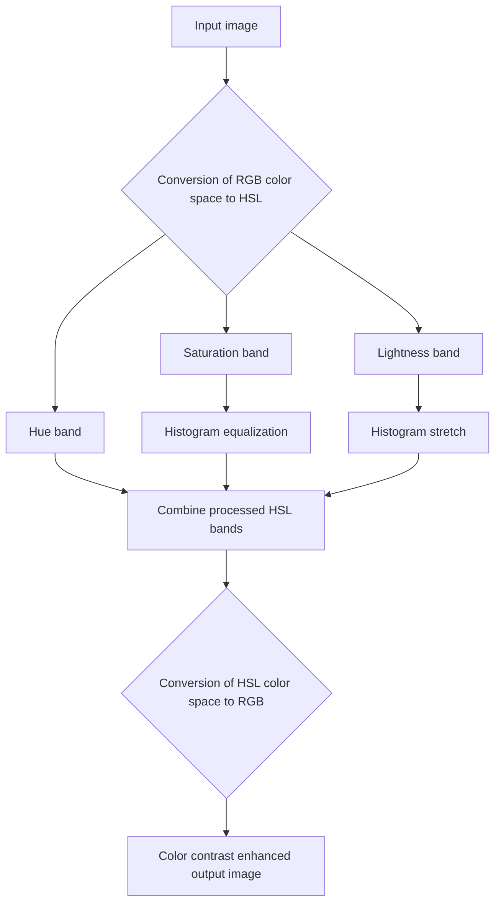

### **Adaptive Contrast Enhancement (ACE)**

$$
\boxed{E(r, c) = k_1 \left[ \frac{m_i(r,c)}{\sigma_l(r, c)} \right] [I(r, c) - m_l(r, c)] + k_2 m_l(r, c)}
$$

**Where:**

* $m_i(r,c)$ = the mean (average) for the entire image $I(r, c)$
* $\sigma_l$ = local standard deviation in the current $n \times n$ window

$$
\sigma_I = \sqrt{ \frac{\sum (I(r,c) - m_i)^2}{n^2 - 1} }
$$

* $m_l$ = local mean in current window
* $k_1$ = local gain factor constant, between 0 and 1
* $k_2$ = local mean constant, between 0 and 1

---

# Adaptive Contrast Enhancement 2 (ACE-2)

$$
\boxed{E(r,c)=k_1\big[\,I(r,c)-m_l(r,c)\,\big]\;+\;k_2\,m_l(r,c)}
$$

**Where:**

* $I(r,c)$ = original image intensity at pixel $(r,c)$.
* $E(r,c)$ = output (enhanced) intensity at pixel $(r,c)$.
* $m_l(r,c)$ = **local mean** in the current $n\times n$ neighborhood around $(r,c)$.

---

## **Logarithmic Adaptive Contrast Enhancement (Log-ACE2) Filter**

$$
E(r,c) = k_1 \Big[ \ln\big(\tilde{I}(r,c)\big) - \ln\big(\tilde{m}_l(r,c)\big) \Big] + k_2\,\tilde{m}_l(r,c)
$$

### Where:

* $\tilde{I}(r,c)$ = **normalized complement of the image**,

  $$
  \tilde{I}(r,c) = 1 - \frac{I(r,c)}{\text{MAX}}
  $$
* $\tilde{m}_l(r,c)$ = **normalized complement of local mean**,

  $$
  \tilde{m}_l(r,c) = 1 - \frac{m_l(r,c)}{\text{MAX}}
  $$
* $m_l(r,c)$ = **local mean** in current window
* $k_1$ = **local gain factor constant**, between 0 and 1
* $k_2$ = **local mean constant**, between 0 and 1

---

## **Exponential ACE filter**

$$\text{Exp-ACE2} \implies E(r, c) = \text{MAX} \times \left[\frac{I(r, c)}{\text{MAX}}\right]^{k_1} + \left[\frac{m_l(r, c)}{I(r, c)}\right]^{k_2}$$

### Where:

* $m_l = \text{local mean in current window}$

* $\text{MAX} = \text{maximum gray value (e.g. 255)}$

* $k_1 = \text{local gain factor exponent}$

* $k_2 = \text{local mean factor exponent}$

